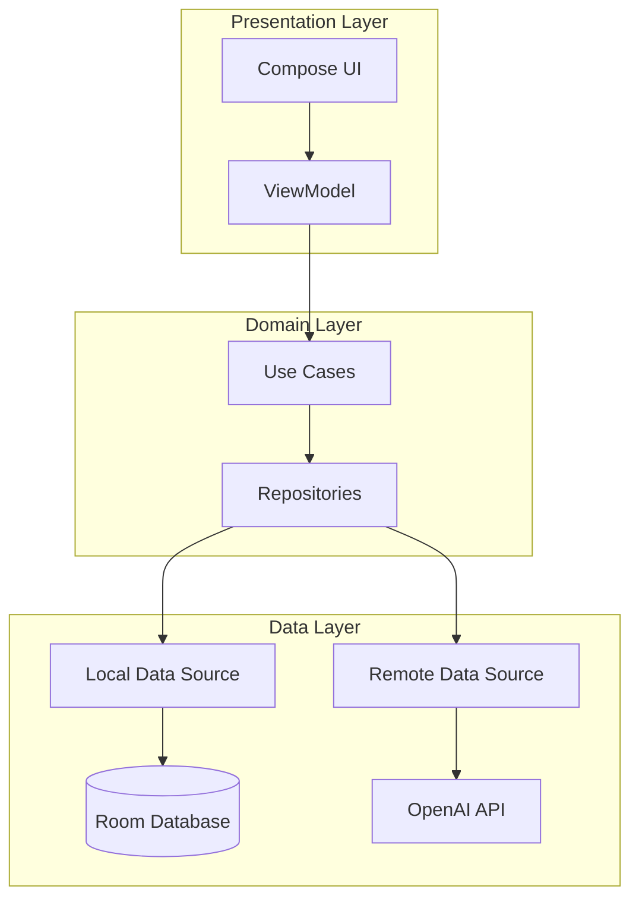
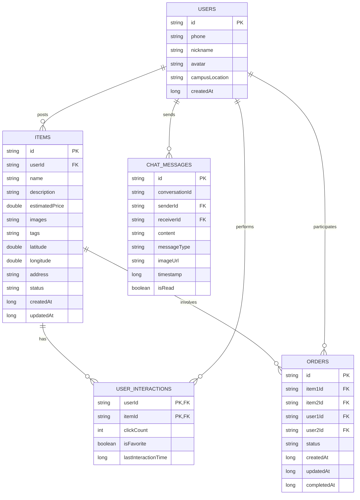

# 校园二手物品交换应用 - 技术设计文档

## Overview

校园二手物品交换应用是一款基于Android平台的移动应用，采用Kotlin语言开发，使用Jetpack Compose构建现代化的用户界面。应用的核心功能包括AI图像识别、智能推荐、以物易物匹配和即时通讯。

### 技术栈

- **开发语言**: Kotlin
- **UI框架**: Jetpack Compose
- **架构模式**: MVVM (Model-View-ViewModel) + Repository Pattern
- **依赖注入**: Hilt/Dagger
- **本地数据库**: Room
- **网络请求**: Retrofit + OkHttp
- **图片加载**: Coil
- **异步处理**: Kotlin Coroutines + Flow
- **导航**: Jetpack Navigation Compose
- **AI服务**: OpenAI GPT-4V API

### 核心功能模块

1. **AI图像识别模块**: 集成OpenAI GPT-4V API，实现物品图片识别和信息生成
2. **数据持久化模块**: 使用Room数据库存储物品、用户、订单、聊天记录等数据
3. **推荐引擎**: 基于规则的智能推荐算法，综合距离、点击和收藏权重
4. **匹配系统**: 基于标签和关键词相似度的以物易物匹配算法
5. **聊天系统**: 本地存储的即时通讯功能
6. **位置服务**: 集成Android Location API，计算物品间距离

## Architecture

### 整体架构

应用采用MVVM架构模式结合Repository模式，确保关注点分离和可测试性。



### 层次结构

#### 1. Presentation Layer (UI层)

**职责**: 显示数据和处理用户交互

**组件**:
- **Composables**: 使用Jetpack Compose构建的UI组件
- **ViewModels**: 持有UI状态，处理业务逻辑，与Repository交互
- **Navigation**: 管理应用内页面导航

**主要屏幕**:
- LoginScreen: 用户登录界面
- HomeScreen: 物品浏览主界面
- ItemDetailScreen: 物品详情界面
- PostItemScreen: 发布物品界面
- ProfileScreen: 个人中心界面
- OrderListScreen: 订单管理界面
- ChatScreen: 聊天界面
- FavoritesScreen: 收藏列表界面

#### 2. Domain Layer (领域层)

**职责**: 包含业务逻辑和用例

**组件**:
- **Use Cases**: 封装单一业务逻辑操作
  - RecognizeItemImageUseCase: 识别物品图像
  - GetRecommendedItemsUseCase: 获取推荐物品
  - GetMatchedItemsUseCase: 获取匹配物品
  - CalculateDistanceUseCase: 计算距离
  - SaveItemUseCase: 保存物品
  - SendMessageUseCase: 发送消息
  
- **Repositories (Interfaces)**: 定义数据访问接口
  - ItemRepository
  - UserRepository
  - ChatRepository
  - OrderRepository
  - AIRepository

#### 3. Data Layer (数据层)

**职责**: 提供数据访问和持久化

**组件**:
- **Repository Implementations**: 实现Repository接口
- **Data Sources**:
  - LocalDataSource: Room数据库访问
  - RemoteDataSource: API网络请求
- **DTOs**: 数据传输对象
- **Entities**: Room数据库实体

### 模块划分

```
com.example.exchangeapp/
├── data/
│   ├── local/
│   │   ├── dao/
│   │   ├── entity/
│   │   └── database/
│   ├── remote/
│   │   ├── api/
│   │   ├── dto/
│   │   └── interceptor/
│   └── repository/
├── domain/
│   ├── model/
│   ├── repository/
│   └── usecase/
├── presentation/
│   ├── screen/
│   │   ├── login/
│   │   ├── home/
│   │   ├── itemdetail/
│   │   ├── postitem/
│   │   ├── profile/
│   │   ├── order/
│   │   ├── chat/
│   │   └── favorites/
│   ├── component/
│   └── navigation/
├── di/
└── util/
```

## Components and Interfaces

### 1. AI图像识别组件

#### OpenAI API集成

**API配置**:
```kotlin
interface OpenAIApiService {
    @POST("v1/chat/completions")
    suspend fun analyzeImage(
        @Header("Authorization") authorization: String,
        @Body request: ImageAnalysisRequest
    ): Response<ImageAnalysisResponse>
}

data class ImageAnalysisRequest(
    val model: String = "gpt-4-vision-preview",
    val messages: List<Message>,
    val maxTokens: Int = 500
)

data class Message(
    val role: String,
    val content: List<Content>
)

data class Content(
    val type: String, // "text" or "image_url"
    val text: String? = null,
    val imageUrl: ImageUrl? = null
)

data class ImageUrl(
    val url: String // Base64编码的图片或URL
)

data class ImageAnalysisResponse(
    val id: String,
    val choices: List<Choice>
)

data class Choice(
    val message: MessageResponse
)

data class MessageResponse(
    val content: String // JSON格式的识别结果
)
```

**配置管理**:

OpenAI API密钥通过以下方式配置（需要用户填写）：

方式1：使用BuildConfig（推荐）
```kotlin
// build.gradle.kts
android {
    defaultConfig {
        // 从local.properties读取API密钥
        val properties = Properties()
        properties.load(project.rootProject.file("local.properties").inputStream())
        buildConfigField("String", "OPENAI_API_KEY", 
            "\"${properties.getProperty("OPENAI_API_KEY", "")}\"")
        buildConfigField("String", "OPENAI_API_ENDPOINT", 
            "\"https://api.openai.com\"")
    }
    
    buildFeatures {
        buildConfig = true
    }
}
```

方式2：使用local.properties（推荐用于敏感信息）
```properties
# local.properties (此文件不应提交到版本控制)
OPENAI_API_KEY=sk-your-api-key-here
OPENAI_API_ENDPOINT=https://api.openai.com
```

**使用示例**:
```kotlin
class AIRepository(
    private val apiService: OpenAIApiService,
    private val apiKey: String = BuildConfig.OPENAI_API_KEY
) {
    suspend fun recognizeItem(imageBase64: String): Result<ItemRecognitionResult> {
        return try {
            val request = ImageAnalysisRequest(
                model = "gpt-4-vision-preview",
                messages = listOf(
                    Message(
                        role = "user",
                        content = listOf(
                            Content(
                                type = "text",
                                text = "请识别这个物品并返回JSON格式：{\"name\":\"物品名称\",\"description\":\"物品描述\",\"estimatedPrice\":估价,\"tags\":[\"标签1\",\"标签2\"]}"
                            ),
                            Content(
                                type = "image_url",
                                imageUrl = ImageUrl(url = "data:image/jpeg;base64,$imageBase64")
                            )
                        )
                    )
                ),
                maxTokens = 500
            )
            
            val response = apiService.analyzeImage(
                authorization = "Bearer $apiKey",
                request = request
            )
            
            if (response.isSuccessful) {
                val content = response.body()?.choices?.firstOrNull()?.message?.content
                if (content != null) {
                    val result = parseRecognitionResult(content)
                    Result.success(result)
                } else {
                    Result.failure(Exception("Empty response from API"))
                }
            } else {
                Result.failure(Exception("API request failed: ${response.code()}"))
            }
        } catch (e: Exception) {
            Result.failure(e)
        }
    }
    
    private fun parseRecognitionResult(json: String): ItemRecognitionResult {
        // 解析JSON响应
        return Json.decodeFromString(json)
    }
}
```

**错误处理与重试机制**:
```kotlin
class OpenAIRetryInterceptor : Interceptor {
    override fun intercept(chain: Interceptor.Chain): okhttp3.Response {
        var request = chain.request()
        var response = chain.proceed(request)
        var tryCount = 0
        
        while (!response.isSuccessful && tryCount < 3) {
            tryCount++
            response.close()
            
            // 对于429 (Rate Limit)或5xx错误进行重试
            if (response.code == 429 || response.code >= 500) {
                Thread.sleep((1000L * tryCount)) // 指数退避
                response = chain.proceed(request)
            } else {
                break
            }
        }
        
        return response
    }
}
```

### 2. 推荐引擎组件

```kotlin
interface RecommendationEngine {
    suspend fun getRecommendedItems(
        userId: String,
        userLocation: Location?,
        limit: Int = 10
    ): List<Item>
    
    fun updateClickWeight(itemId: String)
    fun updateFavoriteWeight(itemId: String)
    suspend fun recalculateScores()
}

class RecommendationEngineImpl(
    private val itemRepository: ItemRepository,
    private val userInteractionRepository: UserInteractionRepository
) : RecommendationEngine {
    
    companion object {
        const val DISTANCE_WEIGHT = 0.4
        const val CLICK_WEIGHT = 0.3
        const val FAVORITE_WEIGHT = 0.3
        const val MAX_DISTANCE_KM = 10.0
    }
    
    override suspend fun getRecommendedItems(
        userId: String,
        userLocation: Location?,
        limit: Int
    ): List<Item> {
        val allItems = itemRepository.getAllItems()
        val userInteractions = userInteractionRepository.getUserInteractions(userId)
        
        val scoredItems = allItems.map { item ->
            val score = calculateRecommendationScore(item, userLocation, userInteractions)
            ScoredItem(item, score)
        }
        
        return scoredItems
            .sortedByDescending { it.score }
            .take(limit)
            .map { it.item }
    }
    
    private fun calculateRecommendationScore(
        item: Item,
        userLocation: Location?,
        interactions: UserInteractions
    ): Double {
        val distanceScore = calculateDistanceScore(item.location, userLocation)
        val clickScore = interactions.getClickCount(item.id) * 0.1
        val favoriteScore = if (interactions.isFavorite(item.id)) 1.0 else 0.0
        
        return (distanceScore * DISTANCE_WEIGHT) +
               (clickScore * CLICK_WEIGHT) +
               (favoriteScore * FAVORITE_WEIGHT)
    }
    
    private fun calculateDistanceScore(
        itemLocation: Location?,
        userLocation: Location?
    ): Double {
        if (itemLocation == null || userLocation == null) return 0.5
        
        val distance = calculateDistance(itemLocation, userLocation)
        return 1.0 - (distance / MAX_DISTANCE_KM).coerceIn(0.0, 1.0)
    }
}
```

### 3. 匹配系统组件

```kotlin
interface MatchingSystem {
    suspend fun getMatchedItems(
        sourceItemId: String,
        limit: Int = 5
    ): List<MatchedItem>
}

data class MatchedItem(
    val item: Item,
    val matchingScore: Double
)

class MatchingSystemImpl(
    private val itemRepository: ItemRepository
) : MatchingSystem {
    
    companion object {
        const val TAG_WEIGHT = 0.6
        const val KEYWORD_WEIGHT = 0.4
    }
    
    override suspend fun getMatchedItems(
        sourceItemId: String,
        limit: Int
    ): List<MatchedItem> {
        val sourceItem = itemRepository.getItemById(sourceItemId) ?: return emptyList()
        val allItems = itemRepository.getAllItems()
            .filter { it.id != sourceItemId }
        
        val matchedItems = allItems.map { item ->
            val score = calculateMatchingScore(sourceItem, item)
            MatchedItem(item, score)
        }
        
        return matchedItems
            .filter { it.matchingScore > 0.3 } // 最低匹配阈值
            .sortedByDescending { it.matchingScore }
            .take(limit)
    }
    
    private fun calculateMatchingScore(source: Item, target: Item): Double {
        val tagScore = calculateTagSimilarity(source.tags, target.tags)
        val keywordScore = calculateKeywordSimilarity(source.description, target.description)
        
        return (tagScore * TAG_WEIGHT) + (keywordScore * KEYWORD_WEIGHT)
    }
    
    private fun calculateTagSimilarity(tags1: List<String>, tags2: List<String>): Double {
        if (tags1.isEmpty() || tags2.isEmpty()) return 0.0
        
        val intersection = tags1.intersect(tags2.toSet()).size
        val union = tags1.union(tags2).size
        
        return intersection.toDouble() / union.toDouble() // Jaccard相似度
    }
    
    private fun calculateKeywordSimilarity(desc1: String, desc2: String): Double {
        val words1 = tokenize(desc1)
        val words2 = tokenize(desc2)
        
        if (words1.isEmpty() || words2.isEmpty()) return 0.0
        
        val intersection = words1.intersect(words2.toSet()).size
        val union = words1.union(words2).size
        
        return intersection.toDouble() / union.toDouble()
    }
    
    private fun tokenize(text: String): Set<String> {
        return text.lowercase()
            .split(Regex("\\W+"))
            .filter { it.length > 1 }
            .toSet()
    }
}
```

### 4. 位置服务组件

```kotlin
interface LocationService {
    suspend fun getCurrentLocation(): Location?
    fun calculateDistance(loc1: Location, loc2: Location): Double
    fun formatDistance(distanceInMeters: Double): String
}

class LocationServiceImpl(
    private val context: Context
) : LocationService {
    
    private val fusedLocationClient = LocationServices.getFusedLocationProviderClient(context)
    
    override suspend fun getCurrentLocation(): Location? = suspendCoroutine { continuation ->
        if (ActivityCompat.checkSelfPermission(
                context,
                Manifest.permission.ACCESS_FINE_LOCATION
            ) != PackageManager.PERMISSION_GRANTED
        ) {
            continuation.resume(null)
            return@suspendCoroutine
        }
        
        fusedLocationClient.lastLocation
            .addOnSuccessListener { location ->
                continuation.resume(location)
            }
            .addOnFailureListener {
                continuation.resume(null)
            }
    }
    
    override fun calculateDistance(loc1: Location, loc2: Location): Double {
        val results = FloatArray(1)
        Location.distanceBetween(
            loc1.latitude, loc1.longitude,
            loc2.latitude, loc2.longitude,
            results
        )
        return results[0].toDouble()
    }
    
    override fun formatDistance(distanceInMeters: Double): String {
        return if (distanceInMeters < 1000) {
            "${distanceInMeters.toInt()}米"
        } else {
            "%.1f公里".format(distanceInMeters / 1000)
        }
    }
}
```

### 5. 聊天系统组件

```kotlin
interface ChatRepository {
    suspend fun getConversation(userId1: String, userId2: String): List<ChatMessage>
    suspend fun sendMessage(message: ChatMessage): Result<Unit>
    suspend fun markAsRead(conversationId: String)
    fun observeConversation(conversationId: String): Flow<List<ChatMessage>>
}

class ChatRepositoryImpl(
    private val chatDao: ChatDao
) : ChatRepository {
    
    override suspend fun getConversation(
        userId1: String,
        userId2: String
    ): List<ChatMessage> {
        val conversationId = generateConversationId(userId1, userId2)
        return chatDao.getMessagesByConversationId(conversationId)
    }
    
    override suspend fun sendMessage(message: ChatMessage): Result<Unit> {
        return try {
            chatDao.insertMessage(message.toEntity())
            Result.success(Unit)
        } catch (e: Exception) {
            Result.failure(e)
        }
    }
    
    override suspend fun markAsRead(conversationId: String) {
        chatDao.markMessagesAsRead(conversationId)
    }
    
    override fun observeConversation(conversationId: String): Flow<List<ChatMessage>> {
        return chatDao.observeMessages(conversationId)
            .map { entities -> entities.map { it.toModel() } }
    }
    
    private fun generateConversationId(userId1: String, userId2: String): String {
        val sorted = listOf(userId1, userId2).sorted()
        return "${sorted[0]}_${sorted[1]}"
    }
}
```

## Data Models

### Domain Models

```kotlin
// 物品模型
data class Item(
    val id: String,
    val userId: String,
    val name: String,
    val description: String,
    val estimatedPrice: Double,
    val images: List<String>, // 图片URL列表
    val tags: List<String>,
    val location: Location?,
    val status: ItemStatus,
    val createdAt: Long,
    val updatedAt: Long
)

enum class ItemStatus {
    AVAILABLE,    // 可用
    RESERVED,     // 已预订
    EXCHANGED,    // 已交换
    DELETED       // 已删除
}

// 用户模型
data class User(
    val id: String,
    val phone: String,
    val nickname: String,
    val avatar: String?,
    val campusLocation: String, // 默认校区
    val createdAt: Long
)

// 位置模型
data class Location(
    val latitude: Double,
    val longitude: Double,
    val address: String?
)

// 订单模型
data class Order(
    val id: String,
    val item1Id: String,
    val item2Id: String,
    val user1Id: String,
    val user2Id: String,
    val status: OrderStatus,
    val createdAt: Long,
    val updatedAt: Long,
    val completedAt: Long?
)

enum class OrderStatus {
    PENDING,      // 待确认
    IN_PROGRESS,  // 进行中
    COMPLETED,    // 已完成
    CANCELLED     // 已取消
}

// 聊天消息模型
data class ChatMessage(
    val id: String,
    val conversationId: String,
    val senderId: String,
    val receiverId: String,
    val content: String,
    val messageType: MessageType,
    val imageUrl: String?,
    val timestamp: Long,
    val isRead: Boolean
)

enum class MessageType {
    TEXT,
    IMAGE
}

// 用户交互模型
data class UserInteraction(
    val userId: String,
    val itemId: String,
    val clickCount: Int,
    val isFavorite: Boolean,
    val lastInteractionTime: Long
)

// AI识别结果模型
data class ItemRecognitionResult(
    val name: String,
    val description: String,
    val estimatedPrice: Double,
    val tags: List<String>
)
```

### Room Database Entities

```kotlin
@Entity(tableName = "items")
data class ItemEntity(
    @PrimaryKey val id: String,
    val userId: String,
    val name: String,
    val description: String,
    val estimatedPrice: Double,
    val images: String, // JSON序列化的图片URL列表
    val tags: String, // JSON序列化的标签列表
    val latitude: Double?,
    val longitude: Double?,
    val address: String?,
    val status: String,
    val createdAt: Long,
    val updatedAt: Long
)

@Entity(tableName = "users")
data class UserEntity(
    @PrimaryKey val id: String,
    val phone: String,
    val nickname: String,
    val avatar: String?,
    val campusLocation: String,
    val createdAt: Long
)

@Entity(tableName = "orders")
data class OrderEntity(
    @PrimaryKey val id: String,
    val item1Id: String,
    val item2Id: String,
    val user1Id: String,
    val user2Id: String,
    val status: String,
    val createdAt: Long,
    val updatedAt: Long,
    val completedAt: Long?
)

@Entity(
    tableName = "chat_messages",
    indices = [Index(value = ["conversationId", "timestamp"])]
)
data class ChatMessageEntity(
    @PrimaryKey val id: String,
    val conversationId: String,
    val senderId: String,
    val receiverId: String,
    val content: String,
    val messageType: String,
    val imageUrl: String?,
    val timestamp: Long,
    val isRead: Boolean
)

@Entity(
    tableName = "user_interactions",
    primaryKeys = ["userId", "itemId"]
)
data class UserInteractionEntity(
    val userId: String,
    val itemId: String,
    val clickCount: Int,
    val isFavorite: Boolean,
    val lastInteractionTime: Long
)
```

### DAOs

```kotlin
@Dao
interface ItemDao {
    @Query("SELECT * FROM items WHERE status = 'AVAILABLE' ORDER BY createdAt DESC")
    suspend fun getAllAvailableItems(): List<ItemEntity>
    
    @Query("SELECT * FROM items WHERE id = :itemId")
    suspend fun getItemById(itemId: String): ItemEntity?
    
    @Query("SELECT * FROM items WHERE userId = :userId")
    suspend fun getItemsByUserId(userId: String): List<ItemEntity>
    
    @Insert(onConflict = OnConflictStrategy.REPLACE)
    suspend fun insertItem(item: ItemEntity)
    
    @Update
    suspend fun updateItem(item: ItemEntity)
    
    @Query("DELETE FROM items WHERE id = :itemId")
    suspend fun deleteItem(itemId: String)
    
    @Query("SELECT * FROM items WHERE tags LIKE '%' || :tag || '%' AND status = 'AVAILABLE'")
    suspend fun getItemsByTag(tag: String): List<ItemEntity>
}

@Dao
interface ChatDao {
    @Query("SELECT * FROM chat_messages WHERE conversationId = :conversationId ORDER BY timestamp ASC")
    suspend fun getMessagesByConversationId(conversationId: String): List<ChatMessageEntity>
    
    @Query("SELECT * FROM chat_messages WHERE conversationId = :conversationId ORDER BY timestamp ASC")
    fun observeMessages(conversationId: String): Flow<List<ChatMessageEntity>>
    
    @Insert(onConflict = OnConflictStrategy.REPLACE)
    suspend fun insertMessage(message: ChatMessageEntity)
    
    @Query("UPDATE chat_messages SET isRead = 1 WHERE conversationId = :conversationId AND receiverId = :userId")
    suspend fun markMessagesAsRead(conversationId: String)
    
    @Query("SELECT COUNT(*) FROM chat_messages WHERE receiverId = :userId AND isRead = 0")
    fun getUnreadCount(userId: String): Flow<Int>
}

@Dao
interface UserInteractionDao {
    @Query("SELECT * FROM user_interactions WHERE userId = :userId")
    suspend fun getUserInteractions(userId: String): List<UserInteractionEntity>
    
    @Query("SELECT * FROM user_interactions WHERE userId = :userId AND itemId = :itemId")
    suspend fun getInteraction(userId: String, itemId: String): UserInteractionEntity?
    
    @Insert(onConflict = OnConflictStrategy.REPLACE)
    suspend fun insertOrUpdateInteraction(interaction: UserInteractionEntity)
    
    @Query("UPDATE user_interactions SET clickCount = clickCount + 1, lastInteractionTime = :timestamp WHERE userId = :userId AND itemId = :itemId")
    suspend fun incrementClickCount(userId: String, itemId: String, timestamp: Long)
}

@Dao
interface UserDao {
    @Query("SELECT * FROM users WHERE id = :userId")
    suspend fun getUserById(userId: String): UserEntity?
    
    @Query("SELECT * FROM users WHERE phone = :phone")
    suspend fun getUserByPhone(phone: String): UserEntity?
    
    @Insert(onConflict = OnConflictStrategy.REPLACE)
    suspend fun insertUser(user: UserEntity)
    
    @Update
    suspend fun updateUser(user: UserEntity)
}

@Dao
interface OrderDao {
    @Query("SELECT * FROM orders WHERE user1Id = :userId OR user2Id = :userId ORDER BY createdAt DESC")
    suspend fun getOrdersByUserId(userId: String): List<OrderEntity>
    
    @Query("SELECT * FROM orders WHERE id = :orderId")
    suspend fun getOrderById(orderId: String): OrderEntity?
    
    @Insert(onConflict = OnConflictStrategy.REPLACE)
    suspend fun insertOrder(order: OrderEntity)
    
    @Update
    suspend fun updateOrder(order: OrderEntity)
}
```

### Database

```kotlin
@Database(
    entities = [
        ItemEntity::class,
        UserEntity::class,
        OrderEntity::class,
        ChatMessageEntity::class,
        UserInteractionEntity::class
    ],
    version = 1,
    exportSchema = false
)
@TypeConverters(Converters::class)
abstract class AppDatabase : RoomDatabase() {
    abstract fun itemDao(): ItemDao
    abstract fun userDao(): UserDao
    abstract fun orderDao(): OrderDao
    abstract fun chatDao(): ChatDao
    abstract fun userInteractionDao(): UserInteractionDao
}

class Converters {
    @TypeConverter
    fun fromTimestamp(value: Long?): Date? {
        return value?.let { Date(it) }
    }

    @TypeConverter
    fun dateToTimestamp(date: Date?): Long? {
        return date?.time
    }
}
```

### 数据库图示



## Correctness Properties

*A property is a characteristic or behavior that should hold true across all valid executions of a system—essentially, a formal statement about what the system should do. Properties serve as the bridge between human-readable specifications and machine-verifiable correctness guarantees.*

本应用的核心算法逻辑和数据处理部分适合使用property-based testing进行验证。以下属性描述了系统应该在所有有效输入下保持的不变性。

### Property 1: 推荐分数计算公式正确性

*For any* Item, user location, and user interaction history, the recommendation score SHALL be calculated as: (distance_score × 0.4) + (click_count × 0.1 × 0.3) + (is_favorite × 1.0 × 0.3), where distance_score = 1.0 - (distance_km / 10.0) clamped to [0.0, 1.0]

**Validates: Requirements 3.2, 3.3**

### Property 2: 推荐结果排序不变性

*For any* list of recommended items with scores, sorting the list by recommendation score in descending order and then sorting again SHALL produce the same ordering (idempotence)

**Validates: Requirements 3.4**

### Property 3: 匹配分数计算组合性

*For any* two Items, the matching score SHALL be calculated as: (tag_similarity × 0.6) + (keyword_similarity × 0.4), where tag_similarity = (intersection_count / union_count) using Jaccard similarity, and keyword_similarity uses the same Jaccard formula on tokenized descriptions

**Validates: Requirements 4.2, 4.3, 4.4**

### Property 4: 匹配结果排序正确性

*For any* list of matched items, the items SHALL be sorted in descending order by matching score, and for all adjacent pairs (item_i, item_{i+1}), item_i.score >= item_{i+1}.score SHALL hold

**Validates: Requirements 4.8**

### Property 5: 标签相似度对称性

*For any* two Items A and B, calculateTagSimilarity(A.tags, B.tags) SHALL equal calculateTagSimilarity(B.tags, A.tags)

**Validates: Requirements 4.3**

### Property 6: 关键词相似度范围约束

*For any* two item descriptions, the keyword similarity score SHALL be in the range [0.0, 1.0], where 0.0 indicates no common keywords and 1.0 indicates identical keyword sets

**Validates: Requirements 4.3**

### Property 7: 表单验证完整性

*For any* item creation form data, the validation logic SHALL reject the form if and only if any required field (name, description, price, or images list) is null, empty, or invalid, and SHALL identify all missing fields in the error response

**Validates: Requirements 6.6**

### Property 8: Item序列化Round-Trip属性

*For any* valid Item object, serializing it to JSON and then deserializing back SHALL produce an Item object that is equal to the original (item == deserialize(serialize(item)))

**Validates: Requirements 12.5**

### Property 9: JSON解析错误鲁棒性

*For any* malformed JSON string (missing required fields, wrong types, or invalid syntax), the parsing function SHALL return a Result.failure with a descriptive error message and SHALL NOT throw uncaught exceptions

**Validates: Requirements 12.3**

### Property 10: 距离计算对称性

*For any* two Locations A and B, calculateDistance(A, B) SHALL equal calculateDistance(B, A) within floating-point precision tolerance

**Validates: Requirements 15.3**

### Property 11: 距离格式化单调性

*For any* distance value d1 and d2 where d1 < d2, if d1 < 1000 and d2 < 1000, both SHALL be formatted as "X米", and if d1 >= 1000 and d2 >= 1000, both SHALL be formatted as "X.X公里"

**Validates: Requirements 15.7**

## Error Handling

### API错误处理

**OpenAI API错误场景**:

1. **网络超时** (10秒):
   ```kotlin
   sealed class ApiError {
       data class NetworkTimeout(val message: String) : ApiError()
       data class NetworkUnavailable(val message: String) : ApiError()
       data class RateLimitExceeded(val retryAfter: Int) : ApiError()
       data class InvalidApiKey(val message: String) : ApiError()
       data class ServerError(val code: Int, val message: String) : ApiError()
       data class ParseError(val message: String) : ApiError()
   }
   ```

2. **重试机制**:
   - 最多重试3次
   - 使用指数退避策略：1秒、2秒、4秒
   - 仅对429 (Rate Limit)和5xx错误重试
   - 4xx错误（除429外）不重试

3. **降级策略**:
   - API失败时，允许用户手动输入所有物品信息
   - 显示友好的错误提示："AI识别服务暂时不可用，请手动填写物品信息"

4. **API密钥验证**:
   - 应用启动时验证API密钥是否配置
   - 如果未配置，禁用AI识别功能，显示配置引导

### 数据库错误处理

**Room数据库错误场景**:

1. **数据库初始化失败**:
   ```kotlin
   try {
       database.init()
   } catch (e: SQLiteException) {
       // 显示错误对话框，建议用户清除应用数据或重新安装
       showCriticalError("数据库初始化失败，请尝试清除应用数据")
   }
   ```

2. **磁盘空间不足**:
   ```kotlin
   catch (e: SQLiteFullException) {
       showError("存储空间不足，请清理设备空间后重试")
   }
   ```

3. **数据完整性错误**:
   ```kotlin
   catch (e: SQLiteConstraintException) {
       Log.e(TAG, "Database constraint violation", e)
       // 静默处理或显示通用错误
   }
   ```

4. **读取默认值策略**:
   - 登录状态读取失败：返回未登录状态
   - 收藏列表读取失败：返回空列表
   - 聊天记录读取失败：返回空列表并提示用户

### 位置服务错误处理

**位置权限和服务错误**:

1. **权限未授予**:
   - 使用默认校区位置（从用户资料获取）
   - 显示提示："使用默认位置，授予定位权限可获得更精准的距离显示"

2. **定位服务未开启**:
   - 提示用户开启定位服务
   - 提供跳转到系统设置的按钮

3. **定位超时**:
   - 5秒超时后使用缓存位置或默认位置
   - 后台继续尝试获取位置

4. **定位精度不足**:
   - 接受精度在500米以内的定位结果
   - 精度超过500米时显示警告图标

### UI层错误处理

**用户交互错误处理**:

1. **图片上传失败**:
   - 显示上传失败的图片缩略图（带错误标记）
   - 提供重试按钮
   - 允许删除失败的图片

2. **表单验证错误**:
   - 实时验证用户输入
   - 高亮显示错误字段
   - 在字段下方显示具体错误原因

3. **网络请求加载状态**:
   - 显示加载动画
   - 支持取消长时间请求
   - 请求超时后显示重试选项

### 日志记录策略

**错误日志分级**:

```kotlin
object ErrorLogger {
    fun logCritical(tag: String, message: String, throwable: Throwable?) {
        // 关键错误：数据库崩溃、应用无法启动
        Log.e(tag, message, throwable)
        // 发送到崩溃报告服务（如Firebase Crashlytics）
    }
    
    fun logError(tag: String, message: String, throwable: Throwable?) {
        // 一般错误：网络请求失败、解析错误
        Log.e(tag, message, throwable)
    }
    
    fun logWarning(tag: String, message: String) {
        // 警告：降级功能使用、非最优路径
        Log.w(tag, message)
    }
    
    fun logInfo(tag: String, message: String) {
        // 信息：正常流程的关键步骤
        Log.i(tag, message)
    }
}
```

## Testing Strategy

### 测试方法概述

本应用采用双重测试策略，结合example-based单元测试和property-based测试，确保全面的代码覆盖和正确性验证。

### Property-Based Testing (PBT)

**适用范围**:
- 算法逻辑：推荐引擎、匹配系统
- 数据处理：JSON解析、序列化
- 数学计算：距离计算、相似度算法

**不适用范围**（使用单元测试替代）:
- UI渲染和布局（使用Compose测试和截图测试）
- 外部API调用（使用集成测试和mock）
- 简单CRUD操作（使用示例测试）
- Android系统服务集成（使用instrumented测试）

**PBT库选择**: 

使用 **Kotest Property Testing** 库：

```kotlin
// build.gradle.kts
dependencies {
    testImplementation("io.kotest:kotest-runner-junit5:5.5.4")
    testImplementation("io.kotest:kotest-assertions-core:5.5.4")
    testImplementation("io.kotest:kotest-property:5.5.4")
}
```

**PBT配置要求**:
- 每个property test最少运行100次迭代
- 使用有意义的生成器（generators）覆盖边界情况
- 每个测试必须包含标签，格式：`// Feature: campus-exchange-app, Property {number}: {property_text}`

### Unit Testing策略

**测试框架**:
- JUnit 5用于单元测试
- MockK用于mock和stub
- Turbine用于Flow测试
- Kotest Assertions用于断言

```kotlin
dependencies {
    testImplementation("junit:junit:4.13.2")
    testImplementation("io.mockk:mockk:1.13.4")
    testImplementation("app.cash.turbine:turbine:0.12.1")
    testImplementation("org.jetbrains.kotlinx:kotlinx-coroutines-test:1.7.3")
}
```

**单元测试覆盖重点**:

1. **ViewModel层测试**:
   ```kotlin
   @Test
   fun `when user favorites an item, it should be added to favorite list`() = runTest {
       // Given
       val viewModel = HomeViewModel(repository, ...)
       val item = createTestItem()
       
       // When
       viewModel.toggleFavorite(item.id)
       
       // Then
       val favorites = viewModel.favoriteItems.first()
       assertTrue(favorites.contains(item.id))
   }
   ```

2. **Repository层测试**:
   - 使用fake DAO实现
   - 验证数据转换逻辑
   - 测试错误处理路径

3. **UseCase测试**:
   - 测试业务逻辑正确性
   - 使用mock repository
   - 验证边界条件

### Property-Based Testing实现示例

#### Property 1-2: 推荐系统测试

```kotlin
class RecommendationEnginePropertyTest : StringSpec({
    // Feature: campus-exchange-app, Property 1: Recommendation score calculation correctness
    "recommendation score calculation follows the formula" {
        checkAll(100, Arb.recommendationInput()) { input ->
            val engine = RecommendationEngineImpl(mockRepository)
            val score = engine.calculateRecommendationScore(
                input.item,
                input.userLocation,
                input.interactions
            )
            
            val expectedDistanceScore = calculateExpectedDistanceScore(
                input.item.location,
                input.userLocation
            )
            val expectedClickScore = input.interactions.getClickCount(input.item.id) * 0.1
            val expectedFavoriteScore = if (input.interactions.isFavorite(input.item.id)) 1.0 else 0.0
            
            val expectedTotal = (expectedDistanceScore * 0.4) + 
                               (expectedClickScore * 0.3) + 
                               (expectedFavoriteScore * 0.3)
            
            score shouldBe (expectedTotal plusOrMinus 0.001)
        }
    }
    
    // Feature: campus-exchange-app, Property 2: Recommendation result sorting invariance
    "sorting recommended items is idempotent" {
        checkAll(100, Arb.list(Arb.scoredItem(), 1..50)) { items ->
            val sorted1 = items.sortedByDescending { it.score }
            val sorted2 = sorted1.sortedByDescending { it.score }
            
            sorted1 shouldBe sorted2
        }
    }
})

// 自定义生成器
fun Arb.Companion.recommendationInput() = arbitrary {
    RecommendationInput(
        item = Arb.item().bind(),
        userLocation = Arb.location().bind(),
        interactions = Arb.userInteractions().bind()
    )
}

fun Arb.Companion.item() = arbitrary {
    Item(
        id = Arb.uuid().bind().toString(),
        userId = Arb.uuid().bind().toString(),
        name = Arb.string(5..50).bind(),
        description = Arb.string(10..200).bind(),
        estimatedPrice = Arb.double(0.0, 10000.0).bind(),
        images = Arb.list(Arb.string(), 1..9).bind(),
        tags = Arb.list(Arb.element(listOf("电子产品", "书籍", "服装", "运动器材", "生活用品")), 1..5).bind(),
        location = Arb.location().bind(),
        status = Arb.enum<ItemStatus>().bind(),
        createdAt = Arb.long(0..System.currentTimeMillis()).bind(),
        updatedAt = Arb.long(0..System.currentTimeMillis()).bind()
    )
}

fun Arb.Companion.location() = arbitrary {
    Location(
        latitude = Arb.double(39.0, 41.0).bind(), // 北京地区
        longitude = Arb.double(116.0, 117.0).bind(),
        address = Arb.string(10..100).bind()
    )
}
```

#### Property 3-6: 匹配系统测试

```kotlin
class MatchingSystemPropertyTest : StringSpec({
    // Feature: campus-exchange-app, Property 3: Matching score calculation composition
    "matching score is correctly composed from tag and keyword similarity" {
        checkAll(100, Arb.itemPair()) { (item1, item2) ->
            val matcher = MatchingSystemImpl(mockRepository)
            val score = matcher.calculateMatchingScore(item1, item2)
            
            val tagSim = matcher.calculateTagSimilarity(item1.tags, item2.tags)
            val keywordSim = matcher.calculateKeywordSimilarity(item1.description, item2.description)
            val expected = (tagSim * 0.6) + (keywordSim * 0.4)
            
            score shouldBe (expected plusOrMinus 0.001)
        }
    }
    
    // Feature: campus-exchange-app, Property 5: Tag similarity symmetry
    "tag similarity is symmetric" {
        checkAll(100, Arb.tagsPair()) { (tags1, tags2) ->
            val matcher = MatchingSystemImpl(mockRepository)
            val sim1 = matcher.calculateTagSimilarity(tags1, tags2)
            val sim2 = matcher.calculateTagSimilarity(tags2, tags1)
            
            sim1 shouldBe (sim2 plusOrMinus 0.0001)
        }
    }
    
    // Feature: campus-exchange-app, Property 6: Keyword similarity range constraint
    "keyword similarity is always between 0 and 1" {
        checkAll(100, Arb.stringPair()) { (desc1, desc2) ->
            val matcher = MatchingSystemImpl(mockRepository)
            val similarity = matcher.calculateKeywordSimilarity(desc1, desc2)
            
            similarity should beGreaterThanOrEqualTo(0.0)
            similarity should beLessThanOrEqualTo(1.0)
        }
    }
    
    // Feature: campus-exchange-app, Property 4: Matching result sorting correctness
    "matched items are sorted in descending order by score" {
        checkAll(100, Arb.list(Arb.matchedItem(), 2..20)) { items ->
            val sorted = items.sortedByDescending { it.matchingScore }
            
            // 验证每对相邻元素都满足递减顺序
            sorted.zipWithNext().forEach { (current, next) ->
                current.matchingScore should beGreaterThanOrEqualTo(next.matchingScore)
            }
        }
    }
})
```

#### Property 7: 表单验证测试

```kotlin
class FormValidationPropertyTest : StringSpec({
    // Feature: campus-exchange-app, Property 7: Form validation completeness
    "form validation correctly identifies all missing required fields" {
        checkAll(100, Arb.itemFormData()) { formData ->
            val validator = ItemFormValidator()
            val result = validator.validate(formData)
            
            val expectedErrors = mutableListOf<String>()
            if (formData.name.isBlank()) expectedErrors.add("name")
            if (formData.description.isBlank()) expectedErrors.add("description")
            if (formData.price <= 0) expectedErrors.add("price")
            if (formData.images.isEmpty()) expectedErrors.add("images")
            
            if (expectedErrors.isEmpty()) {
                result.isSuccess shouldBe true
            } else {
                result.isFailure shouldBe true
                val error = result.exceptionOrNull() as? ValidationException
                error shouldNotBe null
                error?.missingFields?.toSet() shouldBe expectedErrors.toSet()
            }
        }
    }
})

fun Arb.Companion.itemFormData() = arbitrary {
    ItemFormData(
        name = Arb.string(0..100).bind(),
        description = Arb.string(0..500).bind(),
        price = Arb.double(-100.0, 10000.0).bind(),
        images = Arb.list(Arb.string(), 0..15).bind(),
        tags = Arb.list(Arb.string(), 0..10).bind()
    )
}
```

#### Property 8-9: 数据序列化测试

```kotlin
class SerializationPropertyTest : StringSpec({
    // Feature: campus-exchange-app, Property 8: Item serialization round-trip
    "serializing and deserializing an Item produces equal object" {
        checkAll(100, Arb.item()) { item ->
            val json = Json.encodeToString(Item.serializer(), item)
            val deserialized = Json.decodeFromString(Item.serializer(), json)
            
            deserialized shouldBe item
        }
    }
    
    // Feature: campus-exchange-app, Property 9: JSON parsing error robustness
    "parsing malformed JSON returns failure with error message" {
        checkAll(100, Arb.malformedJson()) { malformedJson ->
            val result = runCatching {
                Json.decodeFromString<ItemRecognitionResult>(malformedJson)
            }
            
            result.isFailure shouldBe true
            val exception = result.exceptionOrNull()
            exception shouldNotBe null
            exception!!.message shouldNotBe null
            exception.message!!.isNotBlank() shouldBe true
        }
    }
})

fun Arb.Companion.malformedJson() = arbitrary {
    val malformedTypes = listOf(
        """{"name": 123, "description": "test"}""", // 类型错误
        """{"name": "test"}""", // 缺少必需字段
        """{name: "test"}""", // 无效语法
        """{"name": "test", "price": "not a number"}""", // 类型错误
        """{"name": null, "description": "test"}""", // null值
        """{""", // 不完整JSON
        """["this", "is", "array"]""" // 错误的顶层类型
    )
    Arb.element(malformedTypes).bind()
}
```

#### Property 10-11: 距离计算测试

```kotlin
class LocationServicePropertyTest : StringSpec({
    // Feature: campus-exchange-app, Property 10: Distance calculation symmetry
    "distance calculation is symmetric" {
        checkAll(100, Arb.locationPair()) { (loc1, loc2) ->
            val service = LocationServiceImpl(mockContext)
            val dist1 = service.calculateDistance(loc1, loc2)
            val dist2 = service.calculateDistance(loc2, loc1)
            
            dist1 shouldBe (dist2 plusOrMinus 0.001)
        }
    }
    
    // Feature: campus-exchange-app, Property 11: Distance formatting monotonicity
    "distance formatting is consistent within ranges" {
        checkAll(100, Arb.double(0.0, 10000.0)) { distance ->
            val service = LocationServiceImpl(mockContext)
            val formatted = service.formatDistance(distance)
            
            if (distance < 1000) {
                formatted should endWith("米")
                formatted.removeSuffix("米").toInt() shouldBe distance.toInt()
            } else {
                formatted should endWith("公里")
                val km = formatted.removeSuffix("公里").toDouble()
                km shouldBe ((distance / 1000) plusOrMinus 0.1)
            }
        }
    }
})
```

### Integration Testing策略

**Instrumented测试**（运行在Android设备/模拟器上）:

```kotlin
// build.gradle.kts
dependencies {
    androidTestImplementation("androidx.test.ext:junit:1.1.5")
    androidTestImplementation("androidx.test.espresso:espresso-core:3.5.1")
    androidTestImplementation("androidx.compose.ui:ui-test-junit4")
    androidTestImplementation("io.mockk:mockk-android:1.13.4")
}
```

**集成测试重点**:

1. **数据库集成测试**:
   ```kotlin
   @RunWith(AndroidJUnit4::class)
   class ItemDaoTest {
       private lateinit var database: AppDatabase
       private lateinit var itemDao: ItemDao
       
       @Before
       fun setup() {
           val context = ApplicationProvider.getApplicationContext<Context>()
           database = Room.inMemoryDatabaseBuilder(context, AppDatabase::class.java).build()
           itemDao = database.itemDao()
       }
       
       @Test
       fun insertAndRetrieveItem() = runTest {
           val item = createTestItemEntity()
           itemDao.insertItem(item)
           
           val retrieved = itemDao.getItemById(item.id)
           assertNotNull(retrieved)
           assertEquals(item.name, retrieved?.name)
       }
   }
   ```

2. **API集成测试**（使用MockWebServer）:
   ```kotlin
   @Test
   fun openAIApiIntegration() = runTest {
       val mockServer = MockWebServer()
       mockServer.enqueue(MockResponse().setBody("""
           {
               "choices": [{
                   "message": {
                       "content": "{\"name\":\"iPhone\",\"description\":\"智能手机\",\"estimatedPrice\":3000,\"tags\":[\"电子产品\"]}"
                   }
               }]
           }
       """))
       mockServer.start()
       
       val repository = AIRepository(apiService, testApiKey)
       val result = repository.recognizeItem(testImageBase64)
       
       assertTrue(result.isSuccess)
       assertEquals("iPhone", result.getOrNull()?.name)
       mockServer.shutdown()
   }
   ```

3. **UI集成测试**（Compose测试）:
   ```kotlin
   @Test
   fun homeScreenDisplaysItems() {
       composeTestRule.setContent {
           HomeScreen(viewModel = mockViewModel)
       }
       
       composeTestRule.onNodeWithText("iPhone 13").assertIsDisplayed()
       composeTestRule.onNodeWithText("¥3000").assertIsDisplayed()
   }
   ```

### 测试覆盖率目标

- **单元测试覆盖率**: 80%以上（UseCase、ViewModel、Repository层）
- **Property测试覆盖率**: 100%（所有定义的correctness properties）
- **集成测试覆盖率**: 关键用户流程100%覆盖
  - 用户登录流程
  - 物品发布流程
  - 物品浏览和搜索流程
  - 聊天和交换流程

### 持续集成配置

**GitHub Actions示例**:

```yaml
name: Android CI

on: [push, pull_request]

jobs:
  test:
    runs-on: ubuntu-latest
    steps:
      - uses: actions/checkout@v3
      - name: Set up JDK 11
        uses: actions/setup-java@v3
        with:
          java-version: '11'
      - name: Run unit tests
        run: ./gradlew test
      - name: Run property tests
        run: ./gradlew test --tests "*PropertyTest"
      - name: Generate coverage report
        run: ./gradlew jacocoTestReport
      - name: Upload coverage to Codecov
        uses: codecov/codecov-action@v3
```

### 测试数据管理

**测试夹具（Test Fixtures）**:

```kotlin
object TestFixtures {
    fun createTestItem(
        id: String = UUID.randomUUID().toString(),
        name: String = "测试物品",
        price: Double = 100.0
    ) = Item(
        id = id,
        userId = "test-user",
        name = name,
        description = "测试描述",
        estimatedPrice = price,
        images = listOf("test-image-url"),
        tags = listOf("电子产品"),
        location = Location(39.9, 116.4, "测试地址"),
        status = ItemStatus.AVAILABLE,
        createdAt = System.currentTimeMillis(),
        updatedAt = System.currentTimeMillis()
    )
    
    fun createTestUser(id: String = "test-user") = User(
        id = id,
        phone = "13800138000",
        nickname = "测试用户",
        avatar = null,
        campusLocation = "北京大学",
        createdAt = System.currentTimeMillis()
    )
}
```

### 测试文档

每个测试类应包含：
- 被测试组件的简要说明
- 测试覆盖的功能点列表
- 特殊边界条件说明
- 对应的需求编号引用

示例：
```kotlin
/**
 * Tests for RecommendationEngine
 * 
 * Covers:
 * - Requirement 3: Smart Recommendation System
 * - Property 1: Recommendation score calculation correctness
 * - Property 2: Recommendation result sorting invariance
 * 
 * Edge cases:
 * - Empty item list
 * - User with no interaction history
 * - Items without location data
 * - Maximum distance scenarios
 */
class RecommendationEngineTest { ... }
```
